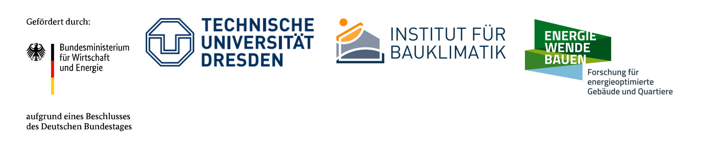
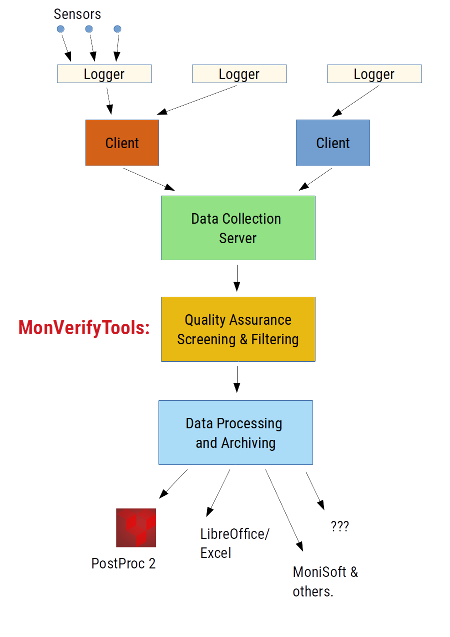

# MonVerifyTools

A set of scripts to automatically check the content of periodically obtained measurement data files, useful for larger monitoring projects.

These tools and the methodology were developed at the [Institut für Bauklimatik, TU Dresden](https://tu-dresden.de/bu/architektur/ibk), during various research projects. Some were:

- EnEff:Stadt - Verbundvorhaben: *Modellhaftes innerstädtisches Gebiet "Altes Zöllnerviertel Weimar"* (FKZ 03ET1173C)
- *Forschungsprüfstand für multtifunktiionale aktive Fassadensysteme mit Raumankopplung*, im Rahmen der SAB Förderung "Anwendungsorientierte Forschung an innovativen Energietechniken"
- *"Carbon Concrete Composite C³" - Carbonbeton mit integrierten bauklimatischen Funktionen*, ein Zwandzig20 C³ Projekt (BMBF)

## Motivation

Engineering/scientific monitoring typically starts small with a few sensors that can be read and analyzed by users in suitable intervals. 
As soon as number of sensors increases and measurement frequency becomes higher (semi-hourly or minutely values), *retrieving* and *checking* the measurement data manually becomes a cumbersome and error-prone process.

Here, the *MonVerifyTools* step in and assist with automated functionality to:

- (push-type) collection of monitoring data files from external sources (clients)
- check for correct input format of measurement files (compare against expected formats)
- perform a set of configured content checks to see if files are complete and valid (e.g. guard against sensor fault, missing time points, broken client/server connections and partial file commits etc.)
- perform additional physical value checks (e.g. out-of-value-range checks, large oszillation/gradient checks, etc.), that signal that something might be wrong with a) sensor, b) monitored system/equipment
- log results of checks to log files for easy screening by human-users
- move offending files to separate review directory, and move correct files to "ready for processing" directories

Basically, you can think of the *MonVerifyTools* as a quality assurance interim step, between *raw data collection* and *actual data processing* (import into monitoring software, run scripts or even just dump it into LibreOffice or Excel).

### Is this something for you?

Whenever you find yourself frequently copying data from a data logger and importing the data into some post-processing software, you may want to take a look at the *MonVerifyTools*.

## What is this toolkit and how does it work?

Basically, it's a Python script that scans a directory structure for rule files, and incoming data. The data files are read/checked and if correct according to requirements moved to an `archive` folder, or if something is amiss, they are moved to a `review` folder, for human users to check and fix. Also, log files are written.

For now, see [documentation](doc/MonVerifyTools_Dokumentation.pdf) (currently only in German, but source code is documented in english).

Btw, the file format used by the *MonVerifyTools* is natively supported by the free scientific post-processing software [PostProc 2](https://bauklimatik-dresden.de/postproc/index.php), which makes it very easy to deal with frequently update data (and creates nice diagrams as well :-).
